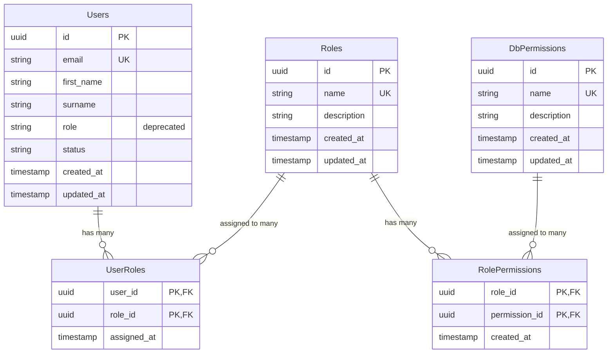
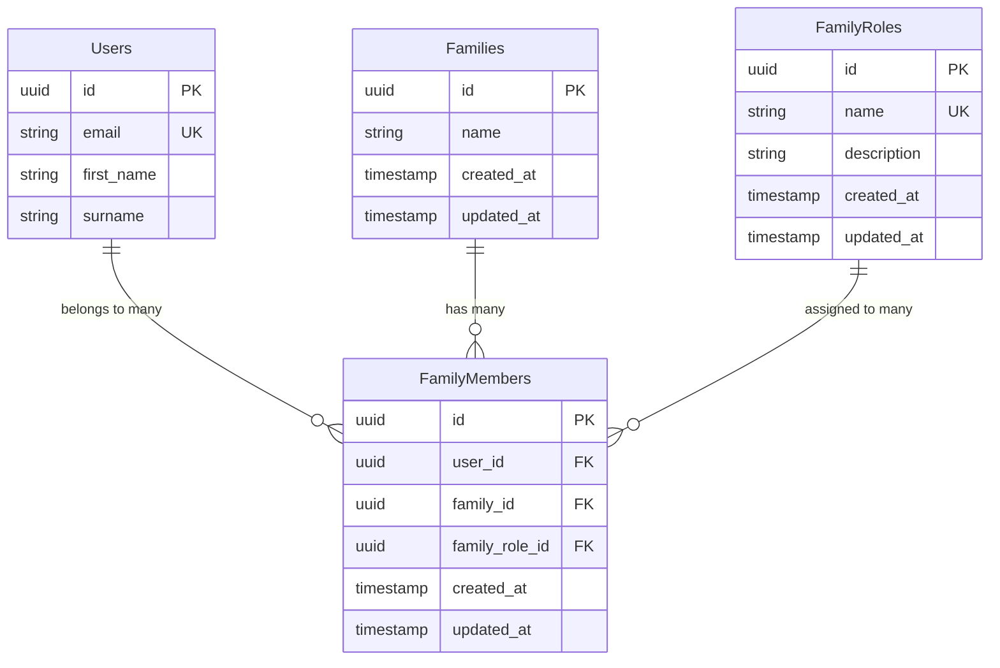
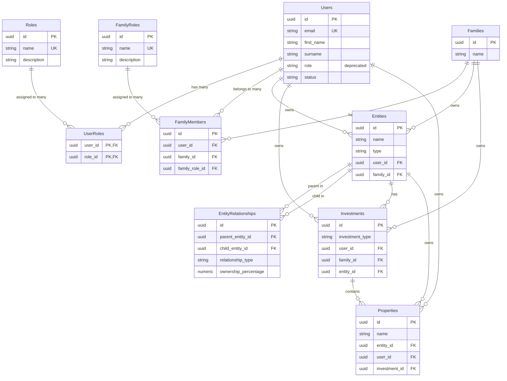
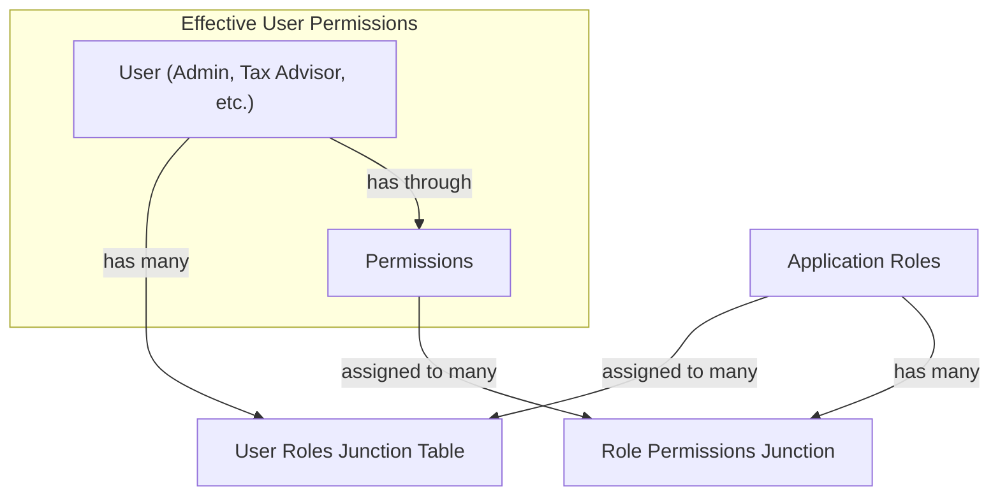
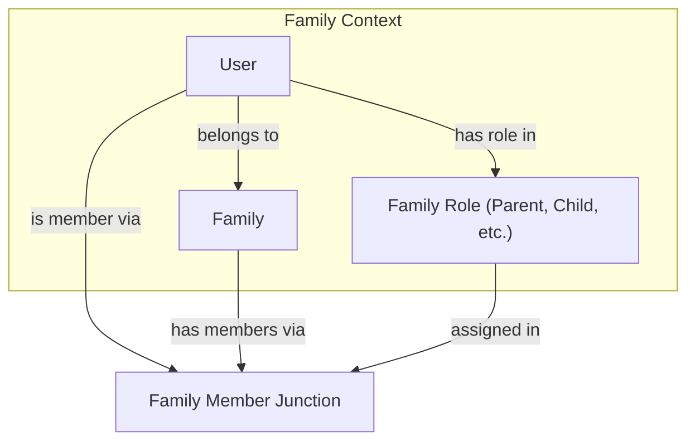
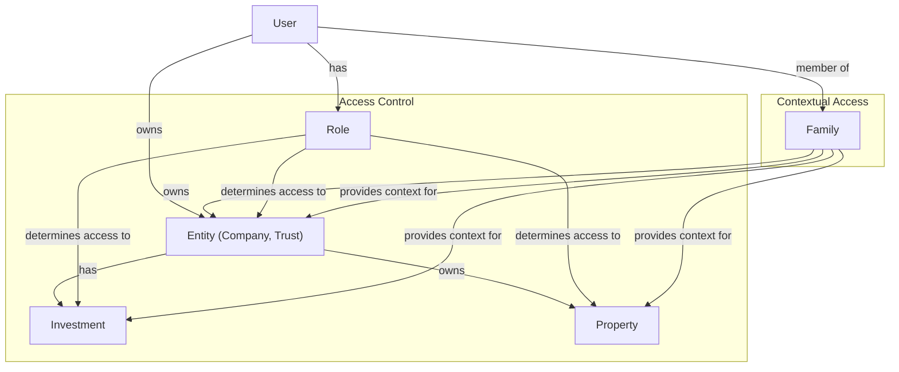

# Kudu Database Relationships

This document outlines the key relationships between tables in the Kudu database, focusing on Users, Roles, Families, and related entities.

## Core User and Role Management

## Family Management Structure

## Complete Entity Relationships

## Key Business Flows

### User Role Assignment Flow

### Family Membership Flow

### Data Ownership and Access Flow

## Implementation Notes

1. The `role` field in the `Users` table is deprecated and will be removed in a future update. User roles are now managed entirely through the `UserRoles` junction table.

2. The `FamilyRoles` table provides a structured approach to defining family roles, replacing the previous text-based approach in the `FamilyMembers` table.

3. The diagram shows how:
   - A user can have multiple application roles (Admin, Tax Advisor, etc.)
   - A user can belong to multiple families
   - Each family membership can have a specific role (Parent, Child, etc.)
   - Entities, investments, and properties can be owned by users or families
   
4. Access control is implemented through a combination of:
   - Application roles and permissions (RBAC)
   - Family membership (contextual access)
   - Entity, investment, and property ownership (data association)
